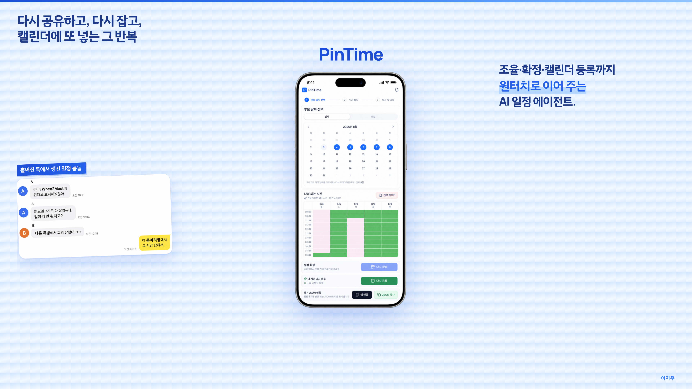
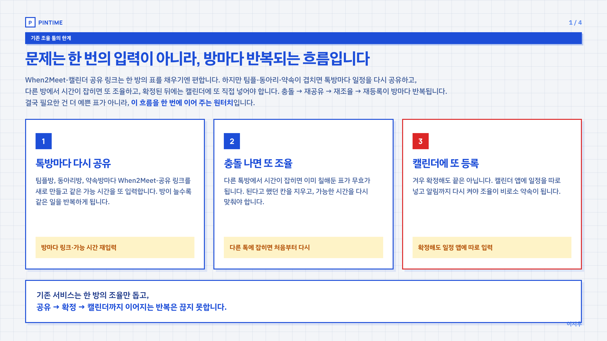
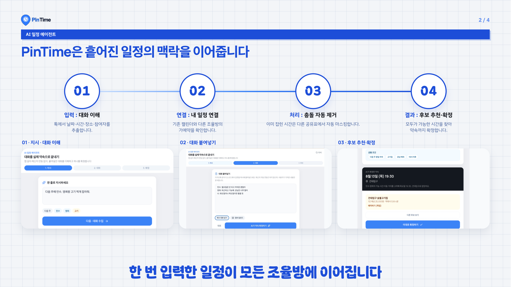
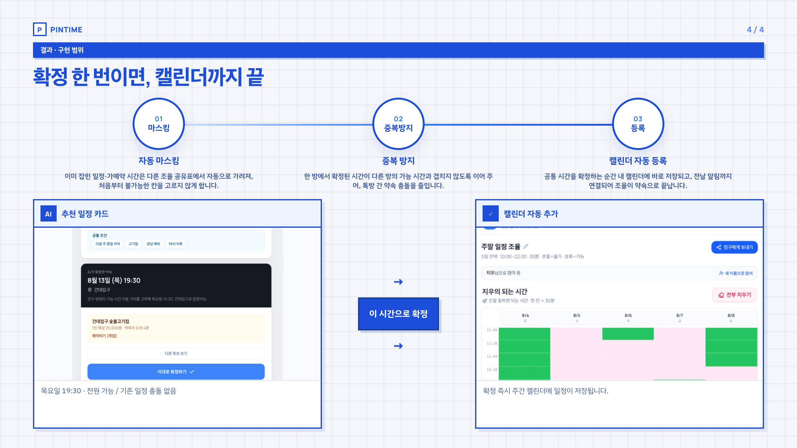

# PinTime (핀타임)

**조율 · 확정 · 캘린더 등록까지, 원터치로 이어 주는 AI 일정 에이전트**

> “야 When2Meet에 된다고 해놓고, 갑자기 안 된다고?”  
> 다른 톡방에서 이미 잡혀 있었습니다.

표만 예쁜 조율 툴이 아닙니다.  
**끊기는 흐름을 한 번에 잇고, 확정하는 순간 캘린더까지 끝내는** 프로토타입입니다.

| | |
|---|---|
| 앱 | [Netlify](https://zesty-clafoutis-473edf.netlify.app) · [Vercel](https://pintime.vercel.app) |
| 사업 소개서 (피치) | [Netlify `/pitch.html`](https://zesty-clafoutis-473edf.netlify.app/pitch.html) · [Vercel](https://pintime.vercel.app/pitch.html) |
| 코드 | [github.com/dlwldn4824/PinTime](https://github.com/dlwldn4824/PinTime) |

```bash
npm install
npm run dev          # http://localhost:5173
npm run build && npm run preview
```

---

## 왜 꼭 필요한가

일정 앱을 켜도, When2Meet·TimePick을 켜도 — 끝나는 게 아닙니다.

| 반복되는 고통 | 실제로 일어나는 일 |
|---|---|
| 방마다 다시 칠하기 | 동아리방 · 팀플방 · 친구방마다 표를 새로 만듦 |
| 확정인 줄 알았는데 깨짐 | 다른 톡에서 같은 시간이 이미 잡혀 있음 |
| 캘린더는 손으로 또 등록 | 조율 툴과 캘린더가 따로 놀아 이중 입력 |
| 가능 시간이 안 이어짐 | 한 번 입력한 일정이 다음 조율에 자동으로 안 감 |

문제는 **한 번의 입력**이 아니라, **방마다 반복되는 흐름**입니다.  
필요한 것은 더 예쁜 빈 표가 아니라 — **이 흐름을 한 번에 이어 주는 원터치**입니다.

---

## 그래서 무엇을 만들었는가

PinTime은 흩어진 일정의 맥락을 이어 줍니다.

```
톡 붙여넣기 → 이해 → 바쁨 가리기 → 겹치는 시간 추천 → 확정 → 캘린더
```

| 기능 | 역할 |
|---|---|
| **AI 일정 에이전트** | 한 줄 지시 + 톡 붙여넣기 → 제약 이해 → 1순위·대안 추천 |
| **내 캘린더 자동 반영** | 바쁜 시간을 뒤집어 조율 방 가능 시간에 마스킹 |
| **링크 공유 조율** | When2Meet식 참여 · 친구 가능 시간 등록 · **겹치는 시간** 히트맵 |
| **공통 가능 시간** | 모두 / 가장 많이 겹치는 구간을 목록으로 바로 고르기 |
| **확정 한 번 = 캘린더** | 조율·에이전트에서 확정하면 같은 캘린더에 즉시 등록 |
| **방 ↔ 캘린더 동기화** | 캘린더에 잡힌 일정은 다른 활성 조율 방에도 반영 (수동 수정 방은 확인 후) |
| **사업 소개서** | 표지 + 4장 HTML 피치 (`/pitch.html`) |

데모는 **로그인 · 결제 · 외부 LLM 없이** 바로 돌아갑니다.  
대화 이해·후보는 로컬 규칙 파이프라인, 방·캘린더는 브라우저 `localStorage` + 압축 링크로 공유합니다.

---

## 누구를 위한 제품인가

| 사용자 | 왜 PinTime인가 |
|---|---|
| **대학생 · 동아리** | 톡방이 여러 개라 같은 시간이 세 번 겹침 |
| **팀플 · 스터디** | 매번 When2Meet를 새로 만들고 표만 채우다 끝남 |
| **친구 · 소규모 모임** | 되는 시간 맞추고도 캘린더에 다시 옮기는 귀찮음 |
| **일정이 많은 사람** | 한 번 잡은 약속이 다음 조율에 자동으로 가려지길 원함 |

**1차 배포 대상:** 위 사용자에게 **지금 당장 눌러보게** 하는 웹 프로토타입  
(심사 · 해커톤 · 피치 · 지인 시연용)

**다음 단계(확장):** 실 LLM · Google/Apple 캘린더 · 계정 · 모바일 앱  
지금 보시는 화면 ≈ 앞으로의 앱 화면입니다.

---

## 피치 스토리 (표지 + 4장)

| 장 | 메시지 |
|---|---|
| **표지** | 흩어진 톡 · AI 일정 에이전트 · PinTime |
| **1/4 문제** | 방마다 반복되는 조율 — 예쁜 표가 아니라 원터치가 필요 |
| **2/4 구조** | 입력 → 연결 → 충돌 제거 → 추천 |
| **3/4 프로토** | 방 생성 · 마스킹 · 링크 · 겹침 |
| **4/4 결과** | 확정 한 번이면, 캘린더까지 |

로컬: [`public/pitch.html`](./public/pitch.html)  
캡처: [`public/pitch-export/`](./public/pitch-export/)

<p align="center">
  
  
</p>
<p align="center">
  
  
</p>

---

## 이렇게 써 보세요 (데모 경로)

1. **에이전트** `/` — `다음 주에 민수, 영희랑 고기 먹게 잡아줘.` + 톡 붙여넣기 → 확정  
2. **캘린더** `/calendar` — 확정된 일정이 이미 들어가 있음  
3. **공유** `/share` — 조율 방 생성 → 내 바쁨 자동 마스킹 → 초대 링크 복사  
4. **참여** `/join/...` — 친구가 가능 시간 등록 → 겹침 · 공통 시간 확인 → 확정  
5. 친구가 **「호스트에게 전달」** 링크를 보내면 호스트 화면에도 겹침이 합쳐집니다  
   (서버 없는 데모라, 기기 간에는 링크로 스냅샷을 넘깁니다)

---

## 배포

| 환경 | URL | 용도 |
|---|---|---|
| **Netlify (권장)** | https://zesty-clafoutis-473edf.netlify.app | 심사·참가자 즉시 체험 |
| **Vercel (미러)** | https://pintime.vercel.app | 동일 빌드 미러 |
| **피치** | `/pitch.html` | 30초 스토리보드 |

설정: [`netlify.toml`](./netlify.toml) — `npm run build` → `dist/` · SPA 리다이렉트

```bash
npm run build
npx netlify-cli deploy --prod --dir=dist   # 또는 Git 연동 자동 배포
```

---

## 기술 · 범위 (정직하게)

**스택:** Vite · React 19 · TypeScript · Tailwind 4 · `localStorage`

| 되어 있음 | 데모 한계 |
|---|---|
| 에이전트 UI · 규칙 기반 파싱·추천 | 외부 LLM 없음 |
| 주간/월간 캘린더 | Google·Apple 연동 없음 |
| 조율 방 · 링크 · 겹침 · 확정 | 서버 DB·실시간 동기화 없음 |
| 캘린더 ↔ 방 가능시간 동기화 | 기기 간은 URL/JSON 스냅샷 |
| 정적 피치 · Netlify/Vercel 배포 | 계정·푸시·실예약 없음 |

한 줄로: **제품 전체**가 아니라, **조율 루프가 끊기지 않는 종단 데모**입니다.

---

## 한 줄로

표 채우다 밤 새지 마세요.  
**확정 한 번이면, 캘린더까지 끝납니다.**  
PinTime.
