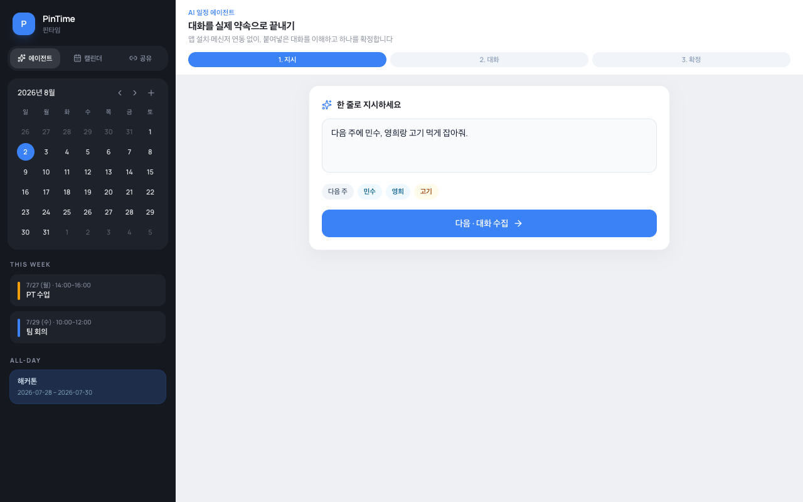
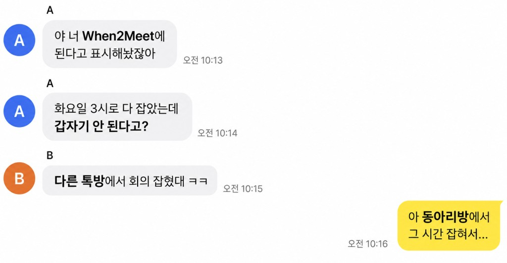

# PinTime (핀타임)

캘린더 기반 일정 조율 데모.

[](https://pintime.vercel.app)

[](https://pintime.vercel.app/pitch.html)

## 실행

```bash
npm install
npm run dev
```

## 화면

| 경로 | 설명 |
|------|------|
| `/` | 에이전트 |
| `/calendar` | 캘린더 — 주간(시간) / 월간(종일·여행) |
| `/share` | 일정 공유 — 방 생성, 링크 복사, 앱 연동, JSON |
| `/join/:roomId` | 링크 참여 — 되는 시간 입력, 모임 시간표, 일정 확정 |
| `/pitch.html` | 사업 소개서 HTML |

## 시연

1. 캘린더에서 주간 드래그(시간) / 월간 드래그(2–4일 여행)
2. **일정 공유** → 방 만들기 → **친구에게 보내기**
3. 상대: 링크 오픈 → 이름 등록 → 되는 시간 칠하기 (또는 앱 연동 / JSON)
4. 모임 전체 시간표에서 구간 드래그 → 일정 확정

> 데모는 서버 없이 동작합니다. 공유 링크에 방 데이터가 포함되어 다른 기기에서도 열 수 있고, 일정이 바뀌면 **최신 공유 링크 복사**로 다시 보내면 됩니다.
