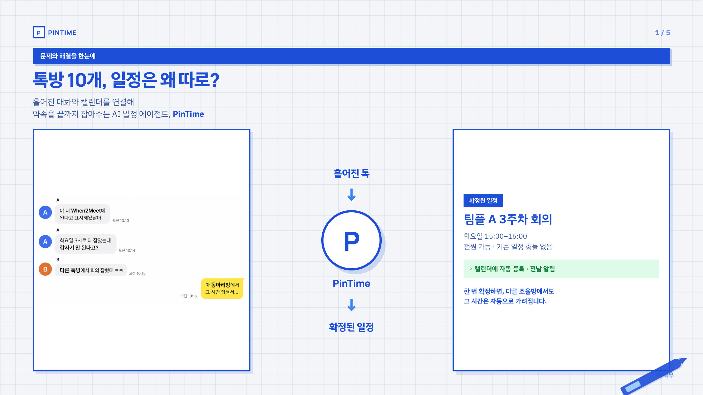
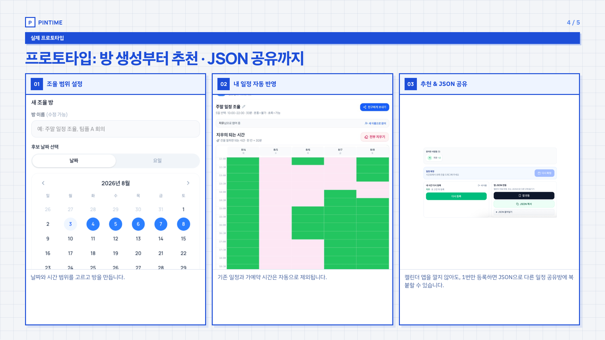

# PinTime (핀타임)

캘린더 기반 일정 조율 데모 · AI 일정 에이전트

## 사업 소개서 (표지 + 5장)

HTML 소개서: [`public/pitch.html`](./public/pitch.html) · https://pintime.vercel.app/pitch.html

### 표지

문제 정의 · 충돌 톡 · PinTime 앱 · AI 일정 에이전트 카피를 한 화면에.


### 1. 문제와 해결을 한눈에

「된다고 칠해둔 그 시간, 다른 톡방에서 이미 잡혀 있다」— 방마다 끊긴 조율과 충돌을 보여주고, PinTime이 확정 일정까지 이어 줍니다.



### 2. 기존 조율 툴의 한계

문제는 “입력”이 아니라, 일정이 방마다 끊긴다는 점입니다. 링크 생성 → 반복 입력 → 톡방 간 충돌의 흐름을 정리합니다.


### 3. AI 일정 에이전트 구조

입력(대화 이해) → 연결 → 충돌 제거 → 추천·확정. 아래에 실제 에이전트 화면(지시 → 대화 붙여넣기 → 확정)을 함께 보여 줍니다.


### 4. 프로토타입 흐름

방 생성 → 내 일정 자동 반영(마스킹) → 추천 & JSON 공유. 캘린더 앱 없이도 한 번 등록한 일정을 JSON으로 다른 방에 복붙할 수 있습니다.



### 5. 확정과 캘린더 등록

확정 한 번이면 캘린더까지 끝. **자동 마스킹 · 중복 방지 · 캘린더 자동 등록**을 중심으로 결과가 이어집니다.


## 실행

```bash
npm install
npm run dev
```

## 화면

| 경로 | 설명 |
|------|------|
| `/` | 에이전트 |
| `/calendar` | 캘린더 — 주간(시간) / 월간(종일·여행) |
| `/share` | 일정 공유 — 방 생성, 링크 복사, 앱 연동, JSON |
| `/join/:roomId` | 링크 참여 — 되는 시간 입력, 모임 시간표, 일정 확정 |
| `/pitch.html` | 사업 소개서 HTML |
